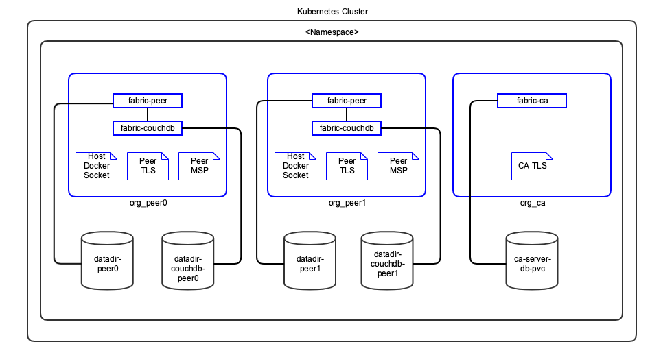
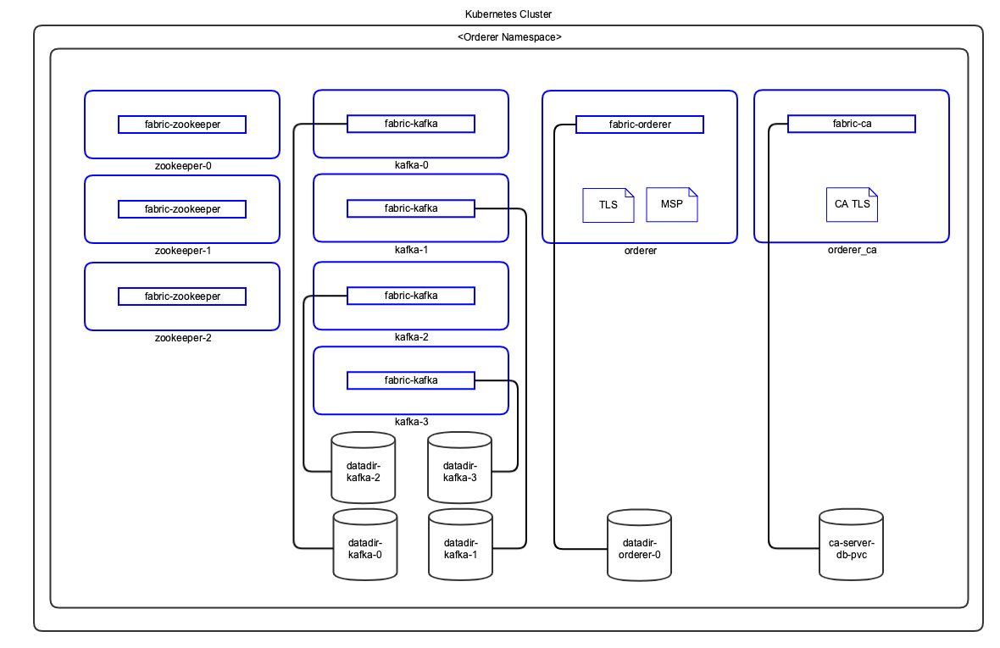

# Hyperledger Fabric Architecture Reference

## Kubernetes

### Peer Nodes

The following diagram shows how Hyperledger Fabric peer nodes will be deployed on your Kubernetes instance.



  

**Notes:**

1. Pods are shown in blue in the diagram.

1. Each peer pod will have both `fabric-peer` and `fabric-couchdb` containers running. Since they are in the same pod, Kubernetes always schedules them on the same VM and they can communicate to each other through localhost. This guarantees minimal latency between them.

1. Host VM's Docker socket is attached to peer pod so it can create chaincode containers. Kubernetes is not aware of these containers.

1. TLS and MSP certificates are mounted as in-memory volumes from the [Vault](#vault-config).

1. The storage uses a Kubernetes Persistent Volume.

  

### Orderer Nodes

The following diagram shows how Hyperledger Fabric orderer will be deployed on your Kubernetes instance.



  

**Notes:**

1. Pods are shown in blue in the diagram.

1. TLS and MSP certificates are mounted as in-memory volumes from the [Vault](#vault-config).

1. The storage uses a Kubernetes Persistent Volume.

  

## Components


  

### Docker Images

The Blockchain Automation Framework uses the officially published Hyperledger Fabric Docker images from [hub.docker.com](https://hub.docker.com/search?q=hyperledger%2Ffabric&type=image). The following Hyperledger Fabric Docker Images are used by the Blockchain Automation Framework.

*  [fabric-ca](https://hub.docker.com/r/hyperledger/fabric-ca) - Hyperledger Fabric Certificate Authority

*  [fabric-couchdb](https://hub.docker.com/r/hyperledger/fabric-couchdb) - CouchDB for Hyperledger Fabric Peer

*  [fabric-kafka](https://hub.docker.com/r/hyperledger/fabric-kafka) - Kafka for Hyperledger Fabric Orderer

*  [fabric-orderer](https://hub.docker.com/r/hyperledger/fabric-orderer) - Hyperledger Fabric Orderer

*  [fabric-peer](https://hub.docker.com/r/hyperledger/fabric-peer) - Hyperledger Fabric Peer

*  [fabric-zookeeper](https://hub.docker.com/r/hyperledger/fabric-zookeeper) - Zookeeper for Hyperledger Fabric Orderer

  

### Ansible Playbooks
 Detailed information on ansible playbooks can be referred [here](../developer/fabric-ansible.md) and the execution process can be referred [here](../operations/setting_dlt.md)

### Helm Charts
Detailed information on helm charts can be referred [here](../developer/fabric-helmcharts.md)


<a  name="vault-config"></a>

## Vault Configuration

The Blockchain Automation Framework stores their `crypto` and `credentials` immediately within the secret secrets engine.

| Crypto Material Path | Credentials Path |
|----------------------|----------------------|
| `secret/crypto` | `secret/credentials` |

  

*  `secret/credentials/ordererOrganizations/<orderer-org>/ca` - Contains password for the Orderer CA Bootstrap user in the format:

```
user="${ORDERER_NAMESPACE}-adminpw
```

*  `secret/credentials/peerOrganizations/<org1>/ca` - Contains password for the Org Peers CA Bootstrap user in the format:

```
user="${NAMESPACE}-adminpw
```

*  `secret/credentials/peerOrganizations/<org1>/<peern>couchdb` - Contains the password for the Peer's CouchDB user in the format:

```
pass="${NAMESPACE}-peer-${n}-adminpw
```

The complete Certificate and key paths in the vault can be referred [here](certificates_path_list_fabric)