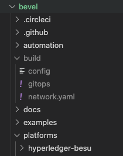

# Network deployment using docker build

## Building the docker image

Build the docker image using the docker file  `Dockerfile` provided in the blockchain-automation-framework repository.

The docker image should be built from the root directory of the repository, the image builds the required base enviorment for BAF deployment and copies the a provisional script `run.sh` in the `WORKDIR`, it also sets a path for mounting volume

Following is a code snippet of the docker image showing `WORKDIR` and `VOLUME`

``` shell
WORKDIR /home/
```
The VOLUME instruction creates a mount point with the specified name and marks it as holding externally mounted volumes from native host

``` shell
VOLUME /home/blockchain-automation-framework/
```

Use the below command to build the image
```
docker build . -t baf-build
```

This would create an image named baf-build


## Running the docker and provisioning script

A shell script `run.sh` is provided in repository to set the environment variables and run the network deployment playbook.  

The BAF `dockerfile` provides defaults for the executing container using the `CMD` variable

``` shell
CMD ["/home/run.sh"]
```
Use the below command to run the container and the provisioning scripts, the command needs to be run from the root directory of the repository. The command also binds and mounts a volume, in this case it binds the repository 

```shell
docker run -v $(pwd):/home/blockchain-automation-framework/ baf-build
```
Before running the above command add a build folder in the root directory of the repository, this build folder should have the following files:

1) K8s config file as config  
2) Network specific configuration file as network.yaml  
3) Private key file which has write-access to the git repo

Screen shot of the folder structure is below:


The paths in network configuration file should be changed accordingly.

